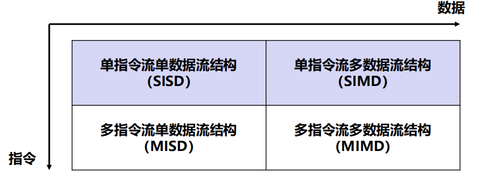
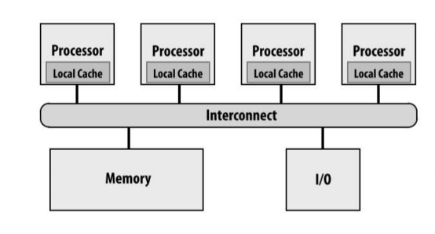
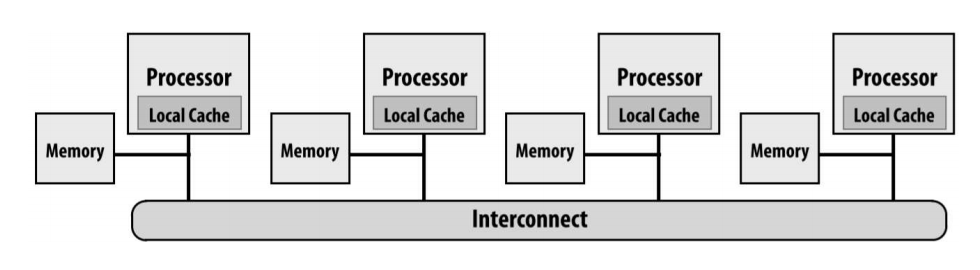
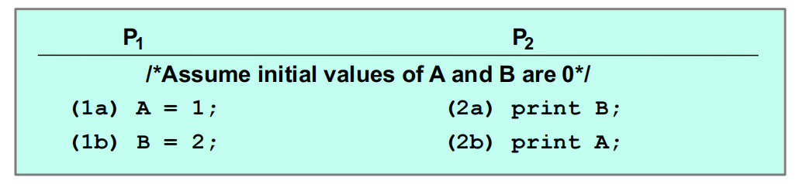
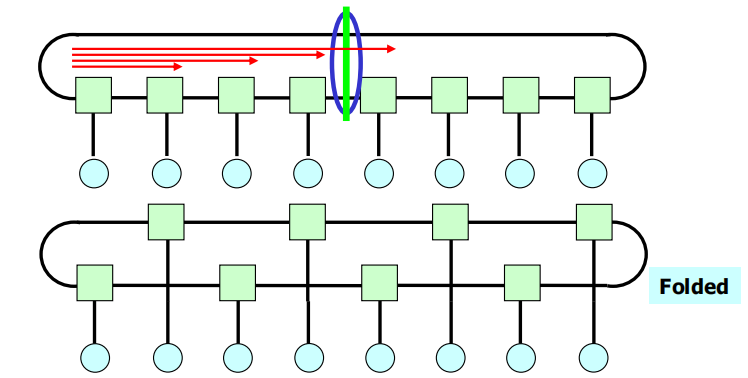

# 并行处理习题

> 1. 从上层应用出发的并行程序的两种通用模型是什么？请列出并分别解释这两种模型。

* **任务并行**：将问题分解为多个任务，不同任务通过通信来协调执行
* **数据并行**：包括大量可并行数据的任务，将数据分配到多个线程上计算

> 2. 列出现代处理器并行执行的主要形式，并分别解释。

* **超标量**：
  * 利用ILP并行处理统一指令流不同指令
  * 硬件自动调度
* **多核**：
  * 多个处理核提供线程级并行，每个内核执行不同的指令流
  * 软件决定
* **SIMD**：
  * 相同指令控制多个ALU，提供数据级并行
  * 编译器调度或硬件调度

> 3. 分析多线程的收益和代价，并举例吞吐导向的多线程代表架构。

* 收益：
  * **更有效利用ALU资源**
  * **隐藏访存延迟**
  * **填充超标量架构多个功能单元**
* 代价
  * **上下文存储开销**
  * **单个线程时间增加**
  * **严重依赖内存带宽**
* 代表架构：**GPGPU**

> 4. Flynn 分类法是如何对并行分类的？



> 5. 多核有哪几种通信方式？

* **共享地址空间**
* **消息传递**
* **数据并行**

> 6. 列举减少访存延迟和隐藏访存延迟的方法

* **Cache**：用Cache缓存常用数据，**减少**访存延迟
* **预取**：动态分析程序访问模式，预测即将访问的数据，取到Cache中，**隐藏**访存延迟

> 7. SMP 和 NUMA 架构分别是什么，各自有什么优缺点。

* SMP**对称多处理器**：缓存不命中时，内存地址访问成本对每个处理器相同

  

* NUMA**非统一内存访问**：访问内存的延迟和带宽对不同处理器不同

  

* 二者对比

  * SMP**在系统中保持统一访问内存时间**，但**成本都高**
  * NUMA**可扩展性好**，但**程序员性能优化工作难度大**

> 8. 并行编程模型分别是哪三种，并分别阐述三种模型各自的特点。

* 共享地址空间
  * **所有处理器都共享一个地址空间**
  * 由于大量load-store，性能不佳
* 消息传递：
  * **所有通信构造为消息**
  * 编程正确性难以保证，但结构化可以获得一个正确、可扩展的程序
* 数据并行：
  * **将整个计算视为一个任务集合，严格限制迭代间的通信量**

> 9. 请举一个常用的混合编程模型的例子？其好处是什么？

* 在超算中，**集群多核节点内使用共享地址空间编程，而节点间使用消息传递**
* 数据并行编程模型支持，在一个核函数内共享内存

> 10. 基于共享地址空间的通用同步原语有哪些？具体进行解释。

* **锁**：**一次只能有一个线程在临界区**，用于局部同步
* **阻塞**`（栅障）`操作：**等待各个线程结束再执行下一项**，用于全局同步

> 11. 在讨论局部性时会从哪两个维度上进行讨论，两种局部性分别指的是什么，cache 利用了哪种局部性原理？

* **时间局部性**：在相对**较短的持续时间**内对特定数据和资源的**重用**
* **空间局部性**：在相对**靠近的存储位置**内使用数据元素
* Cache利用了**时间和空间局部性**

> 12. 导致 cache miss 的原因是什么？并分析如何避免/减少每种 cache miss？

* Cold Miss（**强制缺失**）：首次访问，数据未命中
* Capacity Miss（**容量缺失**）：缓存容量不足导致缓存未命中
* Conflict Miss（**冲突缺失**）：缓存未满但由于组相连导致数据只能放到那些未空闲位置
* Communication Miss（**通信缺失**）：Cache一致性导致`（例如MSI中写要无效掉其他Cache中的该数据）`

> 13. 请列举出降低通信开销的几种方法？

* **减少通信次数**：将更多信息放到更少的消息中
* **减少延迟**：利用局部性、改进通信体系结构
* **减少竞争**：复制竞争资源为本地副本、错峰访问
* **增加通信/计算重叠**：异步通信、需要额外并发性

> 14. 并行编程中，造成竞争的原因有哪些，如何减小竞争？

* 原因：
  * **共享资源**的存在可能引发竞争
  * **对负载平衡等的优化**可能引入新的竞争
  * **局部性不足**：局部性优化的目标之一也是要减少竞争
* 方法：
  * **减少对竞争资源的访问量**：复制竞争资源
  * **错开对竞争资源集中访问**

> 15. 介绍为了使工作负载更均衡，在任务调度时可以采取的机制，以及可能的困难。
>
>     （隐藏问题：做负载均衡的原因是什么？困难的解决方案）

* 原因：**提高计算资源利用率**
* 方法：**任务窃取**
  * 当某个线程空闲时，可以从其他线程窃取任务过来自己执行
* 好处：
  * **避免线程频繁同步**
  * **提升数据局部性**
* 困难：
  * 窃取时依然可能产生**同步和通信开销**：选取恰当时刻进行窃取
  * 需要决策**从哪里偷和偷多少**：这**和应用类型、硬件架构高度相关**
  * 需要能检测程序终止，还要保证本地队列确实更快

> 16. 导致应用可扩展性差的因素有哪些？并从中选出两个因素分析如何发现这种因素以及如何解决？

* **串行算法实现性能**
* **关键路径**
  * 判定：**性能停在一个相对固定的值上**
  * 解决：**从关键路径上删除一些任务**，缩短依赖链条
* **瓶颈问题**
  * 判定：**处理器A正忙，其他处理器在等A**
  * 解决：用**更有效的通信手段**、**层次化主从计算结构**
* **算法开销**：并行化可能需要更多开销
* **通信开销**：不同进程间通信可能随系统规模增大而增大
* **负载均衡**：所有处理器在等最慢的
* **无法预测的损失**：某些结果不需要

> 17. 请解释强可扩展性和弱可扩展性。
>
>     （隐藏问题：Amdahl、Gustafson、Sun-Ni定律）

* 强可扩展性：线程数增加，问题规模不变时，并行性能提升
* 弱可扩展性：线程数增加，问题规模也等比增加时，并行性能提升
* Amdahl定律：$S=\frac{W_s+W_p}{W_s+W_p/p}=\frac1{f+(1-f)/p}$，描述强可扩展性问题
* Gustafson定律：$S=\frac{W_s+pW_p}{W_s+pW_p/p}=f+p(1-f)$，描述弱可扩展性
* Sun-Ni定律：$S=\frac{W_s+G(p)W_p}{W_s+G(p)W_p/p}=\frac{f+G(p)(1-f)}{f+G(p)(1-f)/p}$，描述了存储受限时的加速

> 18. 导致并行计算无法达到理想加速比的并行性能开销有哪些？

同16

> 19. 请画出 VGG 和 MobileNet 两个神经网络模型推理对应的 roofline 模型，并标出 VGG 和 MobileNet 在图中的位置。

**必须注意：所有和内存相关的1K=1024，否则1K=1000**

* 横轴上标出计算卡的机器平衡点，这个点左侧就是Memory Bound，右侧就是Compute Bound。
* 纵轴上标出计算卡的浮点型极值点，这两个坐标确定的就是计算卡的平衡点
* 以计算卡内存使用速率为斜率，连接原点和计算卡的平衡点，画出正比例函数，到达计算卡平衡点后变为横线，计算出这个横线对应的纵轴坐标，**任何任务的浮点操作速率不会超过这个值**
* 分别计算两个网络模型的机器平衡点（用In Units的数据读取内存和浮点操作数），在图中标出，分析属于哪个区域

> 20. 请结合 roofline 模型，在下述配置的处理器中优化 Stencil 程序。

* 打开OpenMP向量优化，并将i维固定

* 矩阵分块：每次相邻多层一起计算，只处理一块数据，提高了局部性，降低有效数据替换出Cache的情况

  ```c++
  int jTiles = (dim / TILE);
  int kTiles = (dim / TILE);
  for(tile = 0; tile < jTiles*kTiles; tile++){
    int kLo = TILE * (tile/jTiles);
    int jLo = TILE * (tile/kTiles);
    // 每次循环遍历kLo/jLo到kLo+TILE/jLo+TILE的数据
  }
  ```

  

* 数据对齐：由于需要考虑六个方位的数据，因此需要矩阵0延拓，是514\*514\*514，但514不是8对齐的，因此将第一维长度扩展改为520

> 21. 请简述并行程序 Benchmark 的选取原则是什么。

* **选择多线程程序**
* **选取新兴的应用负载**
* **应用种类多样化**：计算密集、访存密集
* **采用当前最先进的技术**计算新兴应用负载

> 22. SIMD 和 SIMT 架构分别是什么，请分别解释。

* SIMD：**直接作用于计算执行单元或向量单元**
  * **一条指令流，每个指令对应多个数据输入**
* SIMT：**扩展到利用线程**
  * **多条指令流构成线程，这些线程构成warp，一个warp处理多个元素**

> 23. 简述线程分组的两种方式，并分析动态线程分组的缺点。

* **静态线程分组**：程序运行之前确定分组
* **动态线程分组**：在程序运行过程中根据需要动态地调整线程分组
  * 访问模式具有随机性
  * 访存局部性困难
  * 存储器带宽下降

> 24. 介绍一下 CUDA 编程中，并发线程的层次结构，以及 CUDA 对并行提供的支撑。

* CUDA层次结构
  * 每个**核函数由许多线程组成**，所有线程执行同样的顺序程序
  * **线程被分组成线程块**，同一块中线程可以协作
* CUDA支持
  * Thread并行：每个Thread独立执行
  * Data并行：
    * 一块中Thread之间数据并行处理
    * 一个核函数的block间数据并行处理
  * Task并行
    * 每个block彼此独立
    * 彼此独立的核函数在不同流中执行

> 25. 请列举至少三种提高 CUDA 代码效率的方法。

* **更细粒度划分任务**，提高任务间并行
* **最大化片上计算工作**，**减少和主存交互**
* **最小化执行分歧和分支**：GPU对分歧的处理性能较差
* **最小化内存分歧**

> 26. 列举四种常见的共享存储多处理器架构，并分别解释。

* 共享Cache结构：不同处理器共享一个Cache，使用Cache的存取完成通信
* 基于总线的共享内存：所有处理器借助总线访问同一个主存，通过存取和Cache一致性协议完成通信
* Dancehall结构：存在多个主存，存储器和主存间存在互联网络，可以帮助存储器来访问任何一个内存
* 分布式内存：每个处理器都有一部分本地内存，可以不通过互联网络来访问，但其他的内存需要通过互联网络访问

> 27. 解释存储一致性模型、顺序一致性模型。
>
>     （隐藏题目：MSI、MESI、MOESI）

* 存储一致性：
  * 定义一个序模型，每个进程看到的对存储器并发读写的序
  * 多个处理器在读取同一个被写的内存位置时不会看到不一致结果
  * 在共享存储空间上，多个进程对存储器的不同单元做并发的读写操作，每个进程都会看到一个这些操作被完成的序
* 顺序一致性：
  * 程序在多处理器上面的任何一次执行的结果都和其中所有操作按某种顺序执行的结果一致
  * 在这种顺序执行中每个处理器所完成的操作的顺序和它的程序执行序一致
* MOESI协议：如果写数据有其他处理器请求，可以不写回主存，改为O状态，后续将由该处理器向其他处理器提供最新数据
  * M状态可以进入O状态，即E时其他处理器读取该块。若该处理器再次要求写数据，则转换为M，其他处理器写则I

> 28. 在顺序同一性下，(A,B)的可能结果包括哪几种？并举例说明对应的实际执行顺序（每种结果举 1 个例子即可）。不可能的结果是什么？如果实际执行的顺序是 1b->1a->2b->2a，满足顺序同一性吗？解释原因。
>
>     

* 可能的结果：1a2a2b1b或1a2a1b2b或2a1a2b1b时（1,0），2a2b1a1b时（0,0），1a1b2a2b时（1,2）
* 不可能的结果（2,0）（即1b在1a前执行且结果不同）
* 虽然程序执行序不同，但结果一样，因此也是顺序同一性

> 29. 举例几种常见的互联拓扑结构，并给出其网络直径和和对分带宽分析。

* Ring：环状网络

  * 网络直径：N/2向下取整

  * 对分带宽（切为两个相同部分的切面上最多有多少条链路）：2links

  * 饱和吞吐：对分带宽/N*2=4/N

  * 构建成本：3端口的switch/router，N条连接线

  * 平均跳步：N/4向下取整

    

* Torus网络：

  * 网络直径：设维度为n，每个维度上有k个节点
    * 若k为偶数，则为nk/2
    * 若k为奇数，则为n(k-1)/2
  * 对分带宽：$2k^{n-1}\times2=4N/k$ link
  * 饱和吞吐：8/k
  * 平均跳步：$\frac{nk}4$或$n(\frac k4-\frac1{4k})$

* Butterfly网络

  * 网络直径：$\log_2N$
  * 对分带宽：N/2 link
  * 饱和吞吐：1

> 30. 论述互连网络中，死锁出现的原因和避免的方法，给出一种避免方法的示例。

* 死锁出现的原因：资源依赖关系成环
* 避免死锁方法：
  * 资源按序分类
    * 将传输路径资源按序分类，每跳请求的资源按序上升
    * 例如：包在距离源节点i跳时，只能请求序为i的buffer
  * 严格规定路由：设定特殊的路由规则来破除资源依赖环
  * 逃逸虚通道

> 31. 片上网络的流控按粒度划分可以分为哪几类，并分别介绍一种对应的流控技术

* 分为基于消息、包和信元的流控
* 流控技术：
  * 电路交换：为每个消息建立从源到目的的专线，减少buffer但资源利用率低
  * 包缓存交换：每级网络只需要接受包头就可以请求下一级，用buffer缓存该包
  * 信源缓存交换：包缓存交换若发生阻塞，当前网络单元只缓存一部分包，剩余部分由上级缓存

> 32. 分析 N 维、每维上有 k 个节点的 Torus 片上互连拓扑结构的对分带宽、饱和吞吐、网络直径和平均跳步。

同29

> 33. 列举常用的利用空间局部性的方法。

* **任务的分配应减少访问模式的空间交叉**
* **组织数据以减少访问模式的空间交叉**
* **防止高速缓存更一般的冲突缺失**
* **每个处理器都使用单独的堆**
* **通过数据拷贝来提高空间局部性**

> 34. 列举事务性内存的优势。

* **易于使用的同步构造**，使用起来像粗粒度锁一样容易
* **性能和细粒度锁相当**
* **原子化失败与恢复**：线程失败不会丢失锁
* **可组合型**：安全可扩展的软件模块组合